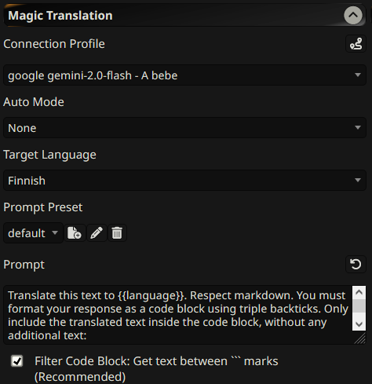

# SillyTavern Magic Translation

**For using the extension, you need to be on `staging` branch of SillyTavern.**

## Overview

A [SillyTavern](https://docs.sillytavern.app/) extension that provides real-time translation of chat messages using configured Language Model APIs. You can configure the translation target language, the prompt used for translation, and which messages should be automatically translated.



## Key Features

*   **Real-time Translation:** Translate chat messages using LLMs.
*   **Configurable API:** Uses [Connection Profiles](https://docs.sillytavern.app/usage/core-concepts/connection-profiles/) to connect to various LLM APIs.
*   **Customizable Prompts:** Modify the prompt used for translation to fine-tune results.
*   **Automatic Translation Modes:** Translate incoming responses, outgoing input, or both automatically.

## Installation

Install via the SillyTavern extension installer:

```txt
https://github.com/bmen25124/SillyTavern-Magic-Translation
```

## How to Use

1.  **Configure Connection Profile:**
    *   Click the plug icon to open SillyTavern's API settings.
    *   Create an connection profile. This profile will be used to send translation requests to the LLM.

2.  **Configure Translation Settings:**
    *   Go to the "Magic Translation" panel in the extension settings.
    *   Select a Connection Profile from the dropdown.
    *   Select desired Auto Mode or leave None if only manual translation is needed.
    *   Choose the Target Language for translation.

3.  **Customize Translation Prompt (Optional):**
    *   Modify the default prompt in the text area to customize translation behavior.
    *   Use `{{prompt}}` as a placeholder for the text to be translated.
    *   Use `{{language}}` as a placeholder for the target language name.

4.  **Use Manual Translation:**
    *   In the chat interface, click the globe icon on a message to translate it.

## Why not use the official Chat Translation extension?

* The official `Chat Translation` extension is uses APIs like Google, Yandex, etc. They are not as powerful as LLMs. They are too formal and not suitable for casual conversations.
* There is only one powerful Translation API, which is [DeepL](https://www.deepl.com), but free users are limited to 500,000 characters per month. Cheapest plan is `$8.74` per month for 1,000,000 characters. In the other side, LLMs are mostly $0.3-$2 per 1,000,000 tokens. (token = 2-3~ letters)

## Recommended LLMs

Make sure the model speaks in your language. Some models might not allow NSFW content.

*   **Google -> Gemini Flash:** Price-efficient. (input: $0.1, output: $0.4)
*   **Cohere -> c4ai-aya-expanse-8b/c4ai-aya-expanse-32b:** Cheap enough (input: $0.5, output: $1.5)
*   **openai-4o/claude-sonnet-3.x:** Little pricey. (input: $2.5/$3.5, output: $10/$15)
*   Depending on your language, you can find many other models.

## Settings

*   **Connection Profile:** The connection profile from Connection Manager that will be used for translation.
*   **Auto Mode:**
    *   `None`: No automatic translation.
    *   `Responses`: Automatically translate messages received from the LLM.
    *   `Inputs`: Automatically translate messages you send to the LLM.
    *   `Both`: Automatically translate both incoming and outgoing messages.
*   **Target Language:** The language to translate the text into.
*   **Prompt:** The prompt used to instruct the LLM to translate the text. Default:

    ```text
    Translate this text to {{language}}. You must format your response as a code block using triple backticks. Only include the translated text inside the code block, without any additional text:

    \`\`\`
    {{prompt}}
    \`\`\`

    Important: Your response must follow this exact format with the translation enclosed in code blocks (\`\`\`).
    ```

*   **Filter Code Block:** When checked, the extension extracts text between the \`\`\` code blocks.
*   **Auto Open Settings when profile not selected:** When checked, the extension automatically opens the settings when a connection profile hasn't been defined.

## Important Notes

*   If you are using this extension, it's recommended to disable the "Auto Mode" feature of the official `Chat Translation` extension (if enabled) to avoid conflicts or unexpected behavior.

## Troubleshooting

*   **Extension Not Showing:**
    *   Ensure the extension is properly installed and enabled in the Extensions tab.
    *   Reload SillyTavern.
*   **Translation Errors:**
    *   Verify that the selected Connection Profile is configured correctly and has a valid API key.
    *   Check the LLM's response for errors or issues.
    *   Adjust the translation prompt if necessary.
*   **Automatic Translation Not Working:**
    *   Ensure the Auto Mode is set correctly.
    *   Verify that the selected Connection Profile is valid.
